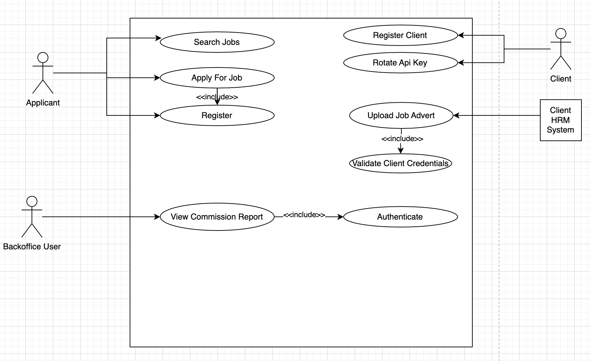
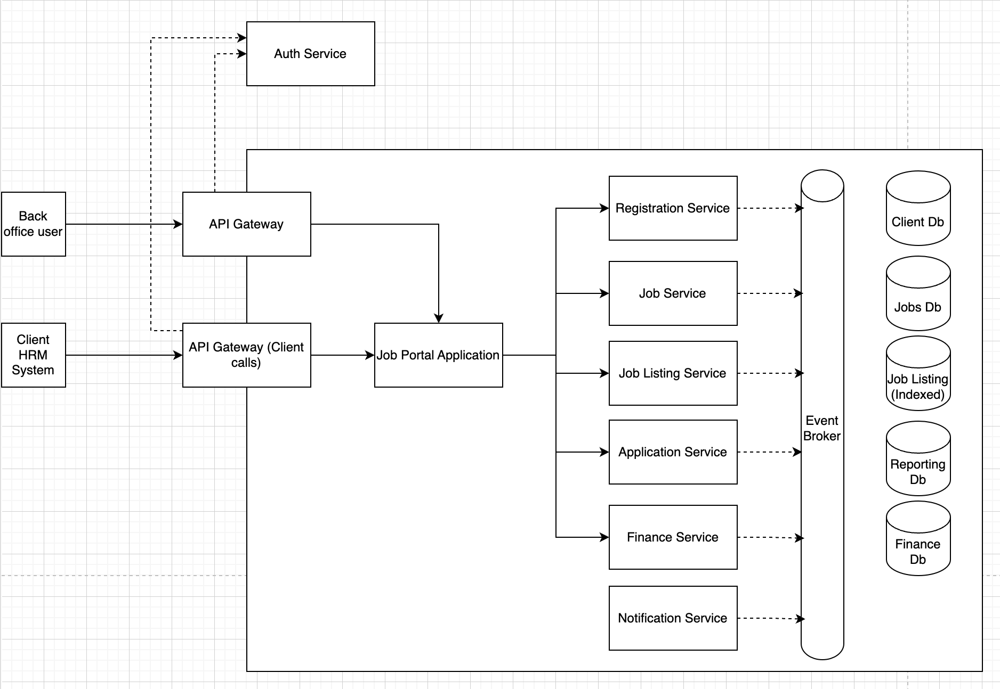

# 1. Project Overview
#### Project Name: Job Portal
#### Author: Pragash Rajarathnam
#### Date: 3rd October 2024
#### Version: 1.0.0

## 1.1 Purpose
This Job Portal allows companies or clients to register and upload job opportunities available in their company. These jobs can then be searched, filtered and viewed by applicants or public users. If the public user wishes they can search a job and apply for that job. Prior to applying for a job each public user has to register with the system. There is a back office module for this application which allows the admin users to view reports such forecast income, etc...

## 1.2 Scope

## 1.3 Stakeholders

# 2. Architecture Overview

This application is going to be designed as a microservice application. We see there are services/modules that need more performant and scaling requirements than other services. Also, there are services that require a different database technology from others. 

## 2.1 Usecase Diagram

## 2.2 Highlevel Architecture Diagram

## 2.3 Microservice Breakdown

### 2.3.1 Identity Service
This is the service that is responsible for registering, authenticating users. This will use oAuth/OIDC for authenticating users. Also, this service will expose a jwk public key url.

This service has the following features,
- Register users
- Login
- Forgot password
- Reset password
- JWK url
Will support integration with other oAuth providers

#### Technologies
AWS Cognito

#### Communication Protocols
HTTPS 2.0 / TLS 1.0

#### Security

### 2.3.2 Client Registration Service
This service is used by clients to register, rotate their API key.

This service allows clients to register with the application. Upon a successful registration an API key is generated and shared with the client. The client has to pass this API key over in their API calls to create job advertisements. The service also allows the user to manage company details such as name, address, contact no, number of employees, roate api keys, etc...

#### Technologies

- Spring Boot
- Kotlin
- Postgresql
- K8S
- Istio
- Docker

#### Communication Protocols

MTLS 

#### Security

### 2.3.3 Job Publication Service

The service which stores the job advertisements for each client. This has end points that can be used by the clients to integrate with their HRM system. Publish job adverts directly from their HRM system with the API key passed in the header.

#### Technologies

- Spring Boot
- Kotlin
- Postgresql
- K8S
- Istio
- Docker
- Kafka

#### Communication Protocols

> MTLS 

### 2.3.4 Application Service

Application service will allow the applicant to apply for a job advert. The applicant can submit his resume and respond job specific questions such as expected salary, contact email, etc...

#### Technologies

- Spring Boot
- Kotlin
- Postgresql
- K8S
- Istio
- Docker
- Kafka

#### Communication Protocols

> MTLS 

### 2.3.5 Forecasting Service

Forecasting service is responsible for listening to events dispatched by other services and storing data for reporting purposes. This service is responsible for calculating the forecast on how much future commission the platform is supposed to earn.

#### Technologies

- Spring Boot
- Kotlin
- Postgresql
- K8S
- Istio
- Docker
- Kafka

#### Communication Protocols

> MTLS 

### 2.3.6 Notification Service

Notification service responsible for dispatching emails, sms, etc... by responding to events from other services.

#### Technologies

- Spring Boot
- Kotlin
- Postgresql
- K8S
- Istio
- Docker
- Kafka

#### Communication Protocols

> MTLS 

# 3. Deployment Overview

This application will be hosted on AWS cloud infrastructure. We will host the backend services in K8S cluster (EKS). Using kafka gives us the needed control, security and scalability. We will Istio service mesh that provides a uniform way to connect, secure, control, and observe microservices.

## 3.1 Deployment Diagram

## 3.2 Infrastructure Components

### 3.2.1 Region
### 3.2.2 VPC
### 3.2.3 EKS
### 3.2.4 Istio
### 3.2.5 API Gateway
### 3.2.6 S3
### 3.2.7 Load Balancers

# 4. Database Management

## 4.1 Service Name
### 4.1.1 Database Type
### 4.1.2 Tables/Collections

# 5. Scalability & Fault Tolerence
## 5.1 Scaling Strategies
### 5.1.1 Horizontal Scaling - Explain how horizontal scaling will be done

## 5.2 Resilience Patterns
### 5.2.1 Circuit Breaker
### 5.2.2 Retry Strategies
### 5.2.3 Timeouts

# 6. Security
## 6.1 Authentication and Authorization
### 6.1.1 Mechanism: (e.g., OAuth 2.0, OpenID Connect). Access Control: How roles and permissions are managed.
## 6.2 Encryption
### 6.2.1 Data Encryption: In-transit and at-rest encryption strategies (e.g., TLS, AES-256).
### 6.2.2 Secrets Management: How secrets (API keys, database credentials) are managed (e.g., HashiCorp Vault, AWS Secrets Manager).

# 7. DevOps and CI/CD
## 7.1 CI/CD Pipeline
### 7.1.1 Tools: List the tools used (e.g., Jenkins, GitLab CI, CircleCI).
### 7.1.2 Automated Tests: Unit tests, integration tests, and deployment pipeline tests.
### 7.1.3 OWASP, Snyk, Sonar Qube

## 7.2 Containerization
### 7.2.1 Containerization Strategy: How services will be containerized (e.g., Docker, Kubernetes).
### 7.2.2 Orchestration: Kubernetes setup, deployment strategies (blue/green, rolling updates).

## 7.3 Monitoring and Logging

### 7.3.1 Logs
Logs should be in the cluster including application logs, networks logs. We should use the ELK stack for this purpose.

ELK - Elasticsearch, Kibana, Logtash

All the logs should be searchable through the Kibana dashboard. We should be able to use the logs to troubleshoot issues. The logs should be formatted/masked appropriately for PII data.

What is PII data?

Emails, user name, password

### 7.3.2 Monitoring

The cluster should be setup with Prometheus to aggregate metrics from the pods. The captured metrics should be available on a Grafana dashboard.

Each application should make sure to expose relevant metric end point.

### 7.3.3 Alerting

We should adapt Slack based alerting mechanism. But, we can evaluate this over a period of time to decide whether we should adapt more complex tools such as PageDuty, OpsGenie

# 8. Testing Strategy
## 8.1 Unit Tests

A reliable unit testing framework should be adapted based on the technology we are working with. All the popular technologies will have their own unit testing frameworks which we can make use of.

- Java - Junit 5, Mockito
- Kotlin - Junit 5, Mockk, 
- .NET - xUnit, Moq

## 8.2 Integration Tests

For integration testing we need to test all the different integrations we have such as Database, Message Broker, Email service, etc... For this purpose we can adapt tools such as 

- TestContainers
- Docker

## 8.4 Performance Testing

Performance testing should be done in a manner which will allow the team to understand and be ready how the application would be able to handle scale up and scale down requirements. 

- Tools - K6
- Strategies - Stress Testing, Spike Testing, Load Testing, Soak Testing

# 9. Deployment Strategy
## 9.1 Environments

We will be deploying to production frequently. Hence, we should be able to rollback in case if things go out of hand. Then, we also want to be able to test our major releases by releasing them to a trusted set of users. Finally we want to deploy with zero down time. Because of this we will adapt the following strategies.

- Canary deployment
- Blue/Green deployment
- Rolling deployment

# 10. Non-Functional Requirements
## 10.1 Performance

- Response Time: The application should have a response time of under 2 seconds for all major user interactions, such as searching for jobs, applying to a job, or viewing profiles.
- Throughput: The system should support a minimum of 1000 concurrent users with no degradation in performance.
- Scalability: The application should be able to handle traffic spikes, especially during peak hours, and scale to accommodate growth in users over time. It should scale horizontally to handle an increase in load.

## 10.2 Reliability and Availability

- Availability: The job portal should be available 99.9% of the time, ensuring minimal downtime. This is crucial, as downtime can lead to lost opportunities for both job seekers and employers.
- Fault Tolerance: In case of hardware or network failures, the application should continue to function with minimal interruption by leveraging redundant systems or failover mechanisms.
- Data Consistency: The application should ensure data integrity and consistency, especially during transactions like job applications and profile updates.

## 10.3 Security

- Data Protection: All sensitive information (e.g., user profiles, resumes, and payment information) must be encrypted both in transit (using HTTPS) and at rest.
- Authentication and Authorization: The system should have secure user authentication (preferably multi-factor authentication) and role-based access control to ensure that only authorized users can access specific features.
- Protection Against Threats: The application should be safeguarded against threats like SQL injection, XSS, CSRF, and DDoS attacks.
- Data Privacy Compliance: The application must comply with relevant data protection regulations (such as GDPR, CCPA) for handling personal data.

## 10.3 Maintainability
> How the architecture ensures ease of updates and maintenance (e.g., modular design, separation of concerns).

