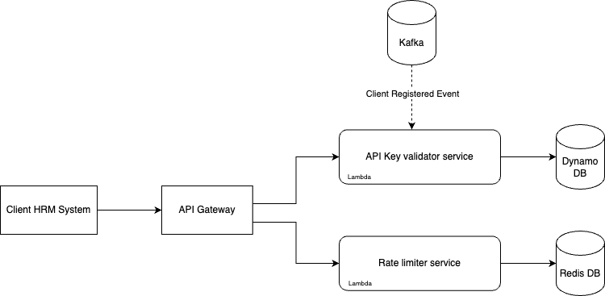

# 1. Project Overview
#### Project Name: Job Portal
#### Author: Pragash Rajarathnam
#### Date: 3rd October 2024
#### Version: 1.0.0

## 1.1 Purpose
This Job Portal allows companies or clients to register and upload job opportunities available in their company. These jobs can then be searched, filtered and viewed by applicants or public users. If the public user wishes they can search a job and apply for that job. Prior to applying for a job each public user has to register with the system. There is a back office module for this application which allows the admin users to view reports such forecast income, etc...

## 1.2 Scope

## 1.3 Stakeholders

# 2. Architecture Overview

This application is going to be designed as a microservice application. We see there are services/modules that need more performant and scaling requirements than other services. Also, there are services that require a different database technology from others. 

## 2.1 Usecase Diagram

## 2.2 Highlevel Architecture Diagram

## 2.3 Microservice Breakdown

### 2.3.1 Identity Service
This is the service that is responsible for registering, authenticating users. This will use oAuth/OIDC for authenticating users. Also, this service will expose a jwk public key url.

This service has the following features,
- Register users
- Login
- Forgot password
- Reset password
- JWK url

#### Technologies
AWS Cognito

#### Communication Protocols
HTTPS 2.0 / TLS 1.0

#### Security

### 2.3.2 Client Registration Service
This service is used by clients to register, rotate their API key.

This service allows clients to register with the application. Upon a successful registration an API key is generated and shared with the client. The client has to pass this API key over in their API calls to create job advertisements. The service also allows the user to manage company details such as name, address, contact no, number of employees, roate api keys, etc...

#### Technologies

- Node
- Typescript
- Express
- Postgresql
- K8S
- Istio
- Docker

#### Security

### 2.3.3 Job Publication Service

The service which stores the job advertisements for each client. This has end points that can be used by the clients to integrate with their HRM system. Publish job adverts directly from their HRM system with the API key passed in the header.

#### Technologies

- Node
- Typescript
- Express
- Postgresql
- K8S
- Istio
- Docker
- Kafka

### 2.3.4 Application Service

Application service will allow the applicant to apply for a job advert. The applicant can submit his resume and respond job specific questions such as expected salary, contact email, etc...

#### Technologies

- Node
- Typescript
- Express
- Postgresql
- K8S
- Istio
- Docker
- Kafka

### 2.3.5 Reporting Service

Forecasting service is responsible for listening to events dispatched by other services and storing data for reporting purposes. This service is responsible for calculating the forecast on how much future commission the platform is supposed to earn.

#### Technologies

- Node
- Typescript
- Express
- Postgresql
- K8S
- Istio
- Docker
- Kafka

### 2.3.6 Notification Service

Notification service responsible for dispatching emails, sms, etc... by responding to events from other services.

#### Technologies

- Node
- Typescript
- Express
- Postgresql
- K8S
- Istio
- Docker
- Kafka

# 3. Deployment Overview

This application will be hosted on AWS cloud infrastructure. We will host the backend services in K8S cluster (EKS). Using kafka gives us the needed control, security and scalability. We will Istio service mesh that provides a uniform way to connect, secure, control, and observe microservices.

## 3.1 Deployment Diagram

### 3.1.1 Frontend

### 3.1.1 Backend

## 3.2 Important Sequence Diagrams

Client Registration Flow

Job Publication Flow

Job Application Flow

Exchange Rate Integration Flow

## 3.2 Infrastructure Components

### 3.2.1 Region
The application will be hosted in the `eu-west-2` region as the product will be launched in UK. The application infrastructure will be hosted in multiple AZs in order to be fault tolerent.

### 3.2.2 VPC
All the services EKS, MSK, RDS, Dynamodb, OpenSearch and Lambda will all run inside a VPC within private subnet across two availability zones.

### 3.2.3 EKS
The backend services will run on K8S and will be hosted on managed `K8S` service of AWS named `EKS`. In addition within the cluster will be using `Istio` service mesh. The cluster will be configured to aggregated application, network logs. TLS termination will happen at the API gateway but within EKS service to service communication will happen using `MTLS` provided by `Istio`. The cluster will be integrated with AWS Secrets manager to update POD environments with the secret values as Environment Variables near real time. We can use Kubernetes Secrets Store CSI Driver for this purpose and each pod should be able to volume mount the secret.

### 3.2.4 Istio

### 3.2.5 API Gateway
We will AWS API Gateway. We will have a gateway for traffic coming from our front end application and another for our third party integrations.

#### 3.2.5.1 Third party integration API Gateway
This gateway will route through the requests from third party HRM systems. It is used to shield other end points from getting exposed to the HRM system. It will implement rate limiting and API Key validation using a Lambda function.

API Key Validator Service
This service will be forwarded the request to validate the API Key and upon validation it will return Http status code `200` or `403`. The API Gateway will forward this response to the up stream. This service will also listen to `ClientRegistered` to fetch the Hashed API key which will be stored in a DynamoDB instance for fast and reliable access.

Rate Limiter Service
The rate limiter service will receive a request and it keeps track of all the requests within the current day in a Redis DB instance. The data in Redis is reset every day. The service will return a http status `429` upon the allowed limit is exceeded by a service.

Diagram

#### 3.2.5.2 Request API Gateway
This will route all the requests to the EKS cluster upon a valid response from `AWS Cognito` service. When it finds that the user is not authenticated it will return a `401`. The front end will redirect the user to the cognito to Authenticate. Upon successful authentication the subsequent requests to the backend will receive the access token which is a JWT token. The API Gateway will validate this access token with AWS Cognito before passing the request to the EKS cluster. The request from the API Gateway will go to the VPC link and from their it will be forwarded to the Network Load Balancer of the service. The NLB knows which port to call and forward the request to.

Diagram

### 3.2.6 S3

# 4. Database Management

- Service - RDS Cluster
- Database Type - Postgresql
- Mode - Multi Availability Zone mode

# 5. Scalability & Fault Tolerance
The database is configured to run in multi AZs mode. The primary instance will serve the requests and the data is replicated to the secondary instance. Upon a failure in the primary `Availability Zone` AWS will seamlessly switch the traffic to the secondary `Availability Zone`.

## 5.1 Scaling Strategies
### 5.1.1 Horizontal Scaling

Horizontal Pod Scaling on EKS, you run and scale your application on EC2 instances managed by EKS. The HPA adjusts the number of pod replicas in a deployment based on real-time demand, scaling the application horizontally.

#### 5.1.2 Production environment

We will have minimum 2 pods and during peak time it can scale upto 5 pods. This limitation should be adjusted observing the demand we experience.

### 5.1.3 Non Production environment

Our services will have 2 pods each on non production environments

# 5. Security
## 5.1 Authentication

### 5.1.1 API Key based Authentication

Once a client is registered with the system they will receive an API Key. This api key should be passed in the header when ever they want to manage job posts from the client's HRM system. In this case we have an API gateway will filter all the requests and validate the API key.

### 5.1.2 Access Token based Authentication

We will be using oAuth for authentication and our IDP will be AWS cognito. All users including clients, back office users and candidates will have to create a user account and authenticate into the system to perform any action.

## 5.2 Encryption

The data in transit will be encrypted using TLS. The Access Token is signed using an Asymmetric Key(Private/Public key).

### 5.2.2 Secrets Management

All the sensitive data is kept in AWS Secret manager

# 7. DevOps and CI/CD
## 7.1 CI/CD Pipeline

Front end

Back end

### 7.1.1 Tools: List the tools used

- Gitlab
- Snyk
- ECR
- Sonar
- Docker

### 7.1.2 Automated Tests: Unit tests, integration tests, and deployment pipeline tests.

- Unit Test
- Integration Test
- Contract Test

## 7.3 Monitoring and Logging

### 7.3.1 Logs
Logs should be in the cluster including application logs, networks logs. We should use the ELK stack for this purpose.

ELK - Elasticsearch, Kibana, Logtash

All the logs should be searchable through the Kibana dashboard. We should be able to use the logs to troubleshoot issues. The logs should be formatted/masked appropriately for PII data.

What is PII data?

Emails, user name, password

### 7.3.2 Monitoring

The cluster should be setup with Prometheus to aggregate metrics from the pods. The captured metrics should be available on a Grafana dashboard.

Each application should make sure to expose relevant metric end point.

### 7.3.3 Alerting

We should adapt Slack based alerting mechanism. But, we can evaluate this over a period of time to decide whether we should adapt more complex tools such as PageDuty, OpsGenie

# 8. Testing Strategy
## 8.1 Unit Tests

A reliable unit testing framework should be adapted based on the technology we are working with. All the popular technologies will have their own unit testing frameworks which we can make use of.

- Java - Junit 5, Mockito
- Kotlin - Junit 5, Mockk, 
- .NET - xUnit, Moq

## 8.2 Integration Tests

For integration testing we need to test all the different integrations we have such as Database, Message Broker, Email service, etc... For this purpose we can adapt tools such as 

- TestContainers
- Docker

## 8.4 Performance Testing

Performance testing should be done in a manner which will allow the team to understand and be ready how the application would be able to handle scale up and scale down requirements. 

- Tools - K6
- Strategies - Stress Testing, Spike Testing, Load Testing, Soak Testing

# 9. Deployment Strategy
## 9.1 Environments

We will be deploying to production frequently. Hence, we should be able to rollback in case if things go out of hand. Then, we also want to be able to test our major releases by releasing them to a trusted set of users. Finally we want to deploy with zero down time. Because of this we will adapt the following strategies.

- Canary deployment
- Blue/Green deployment
- Rolling deployment

# 10. Non-Functional Requirements
## 10.1 Performance

- Response Time: The application should have a response time of under 2 seconds for all major user interactions, such as searching for jobs, applying to a job, or viewing profiles.
- Throughput: The system should support a minimum of 1000 concurrent users with no degradation in performance.
- Scalability: The application should be able to handle traffic spikes, especially during peak hours, and scale to accommodate growth in users over time. It should scale horizontally to handle an increase in load.

## 10.2 Reliability and Availability

- Availability: The job portal should be available 99.9% of the time, ensuring minimal downtime. This is crucial, as downtime can lead to lost opportunities for both job seekers and employers.
- Fault Tolerance: In case of hardware or network failures, the application should continue to function with minimal interruption by leveraging redundant systems or failover mechanisms.
- Data Consistency: The application should ensure data integrity and consistency, especially during transactions like job applications and profile updates.

## 10.3 Security

- Data Protection: All sensitive information (e.g., user profiles, resumes, and payment information) must be encrypted both in transit (using HTTPS) and at rest.
- Authentication and Authorization: The system should have secure user authentication (preferably multi-factor authentication) and role-based access control to ensure that only authorized users can access specific features.
- Protection Against Threats: The application should be safeguarded against threats like SQL injection, XSS, CSRF, and DDoS attacks.
- Data Privacy Compliance: The application must comply with relevant data protection regulations (such as GDPR, CCPA) for handling personal data.
